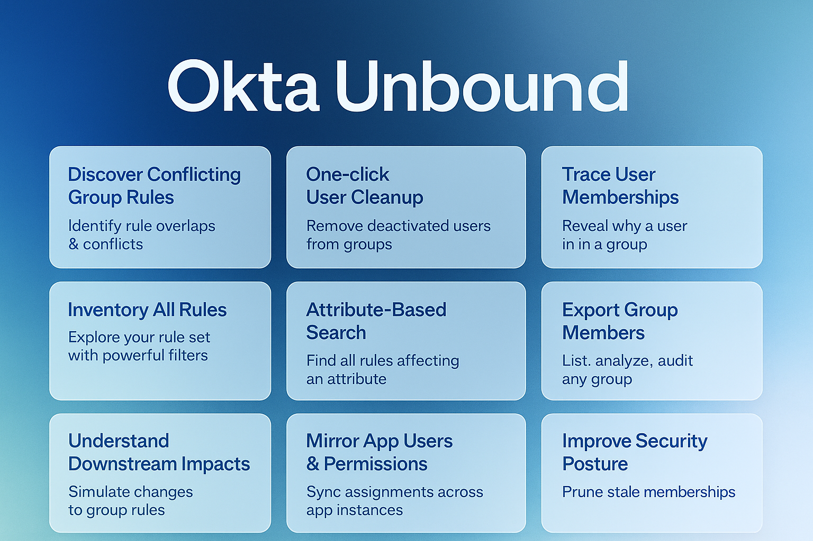

# Okta Unbound 🚀

**Advanced group and user management for Okta administrators**

[](LICENSE)
[](manifest.json)
[](https://www.google.com/chrome/)
[](https://github.com/samdhenderson/okta-unbound/actions/workflows/ci.yml)
[](https://codecov.io/gh/samdhenderson/okta-unbound)



> Streamline your Okta administration with powerful bulk operations, intelligent filtering, and automated cleanup tools.

---

## ✨ Features

### Currently Available

✅ **Sidebar UI**
Modern sidebar interface with tabbed navigation for better organization and more screen space

✅ **Confirmation Modals**
All operations require confirmation with API cost estimates before execution

✅ **API Cost Transparency**
Hover tooltips and confirmation dialogs show estimated API request counts

✅ **Rule Inspector (NEW)**
Analyze all group rules in your organization, detect conflicts, and understand rule logic

✅ **One-Click User Cleanup**
Remove deprovisioned (deactivated) users from groups instantly with a single click

✅ **Smart Cleanup Automation**
Automatically remove all inactive users (DEPROVISIONED, SUSPENDED, LOCKED_OUT) in one operation

✅ **Export Group Members**
Export member lists to CSV or JSON with optional status filtering

✅ **Custom Status Filtering**
Filter and manage users by any Okta status - suspended, locked, staged, and more

✅ **Modular Architecture**
Clean, maintainable code structure with separated core utilities and feature modules

✅ **Handles Large Groups**
Efficiently process groups with 10,000+ members using smart pagination

✅ **Real-Time Progress Tracking**
Watch operations in real-time with detailed progress bars and logging

✅ **Session-Based Authentication**
No API tokens required - uses your existing Okta browser session securely

✅ **Smart Error Handling**
Detects group types, permissions issues, and provides actionable error messages

### Coming Soon (Roadmap)

🔜 **Trace User Memberships**
Understand exactly why users are in specific groups with visual traces

🔜 **Attribute-Based Deep Dive**
Analyze and filter users by profile attributes across groups

🔜 **Mirror App Users & Permissions**
Sync application assignments across groups easily

🔜 **Bulk Operations Across Groups**
Run cleanup and management operations across multiple groups simultaneously

🔜 **Improve Security Posture**
Automated detection and removal of stale memberships with scheduled audits

## Supported User Statuses

Based on the official Okta API documentation:

- **STAGED** - Accounts first created, before activation flow is initiated
- **PROVISIONED** - User hasn't provided verification or password (shows as "Pending User Action" in Admin Console)
- **ACTIVE** - User account is active and can access applications
- **RECOVERY** - User has requested or admin initiated a password reset
- **PASSWORD_EXPIRED** - Password has expired and requires update
- **LOCKED_OUT** - User exceeded login attempts defined in login policy
- **SUSPENDED** - Admin explicitly suspended the account (application assignments retained)
- **DEPROVISIONED** - Admin deactivated/deprovisioned the account (shows as "Deactivated" in Admin Console)

## Installation

### Method 1: Load as Unpacked Extension (Recommended for Development)

1. **Download or clone this repository**
   ```bash
   git clone <your-repo-url>
   cd okta-extension
   ```

2. **Open Chrome and navigate to Extensions**
   - Go to `chrome://extensions/`
   - Or click the three dots menu → More Tools → Extensions

3. **Enable Developer Mode**
   - Toggle the "Developer mode" switch in the top right corner

4. **Load the Extension**
   - Click "Load unpacked"
   - Select the `okta-extension` folder
   - The extension should now appear in your extensions list

5. **Pin the Extension** (Optional)
   - Click the puzzle piece icon in Chrome's toolbar
   - Find "Okta Group Manager" and click the pin icon

### Method 2: Package as CRX (For Distribution)

1. In Chrome extensions page (`chrome://extensions/`)
2. Click "Pack extension"
3. Select the extension directory
4. Chrome will create a `.crx` file and a `.pem` key file
5. Distribute the `.crx` file (keep the `.pem` file secure)

## Usage

### Basic Workflow

1. **Navigate to Okta**
   - Log into your Okta admin console
   - Navigate to a specific group page (e.g., `https://your-domain.okta.com/admin/group/00g...`)

2. **Open the Extension**
   - Click the Okta Group Manager icon in your Chrome toolbar
   - The extension will automatically detect the current group

3. **Run Operations**
   - Choose an operation:
     - **Remove Deactivated Users**: One-click operation to remove all deactivated users
     - **Custom Filter**: Select any user status and choose to list or remove

4. **Monitor Progress**
   - Watch the progress bar for operation status
   - View detailed logs in the Results section

### Example: Remove Deprovisioned Users

```
1. Navigate to: https://your-domain.okta.com/admin/group/00g1234567890abcdef
2. Click the extension icon
3. Click "Run Operation" under "Remove Deprovisioned Users"
4. Wait for completion
5. Review the results log
```

### Example: List Suspended Users

```
1. Navigate to a group page
2. Open the extension
3. Select "SUSPENDED" from the status dropdown
4. Select "List Only" from the action dropdown
5. Click "Run Custom Filter"
6. View the list of suspended users in the results
```

## How It Works

### Authentication
The extension uses your existing Okta browser session to make API requests. This means:
- No API tokens needed
- No additional authentication required
- All requests are made with your current permissions
- Works with SSO and MFA sessions

### API Requests
The extension makes direct calls to the Okta API:
- `GET /api/v1/groups/{groupId}/users` - List group members (with limit=200 per page)
- `DELETE /api/v1/groups/{groupId}/users/{userId}` - Remove user from group
- **Automatic Pagination**: Follows Okta's Link headers to fetch all pages for groups with 200+ members
- Handles rate limiting protection (100ms delay between operations)
- Supports groups of any size (tested with 1000+ member groups)

### Safety Features
- Confirmation of group information before operations
- Detailed logging of all actions
- Error handling for failed operations
- No data is stored outside your browser session

## Permissions Explained

The extension requires these permissions:

- **activeTab**: Access the current Okta page to detect group info
- **scripting**: Inject scripts to make authenticated API calls
- **storage**: Store extension preferences (minimal usage)
- **host_permissions**: Access Okta domains (okta.com, oktapreview.com, okta-emea.com)

## Troubleshooting

### Extension Not Detecting Group
- Ensure you're on a group detail page (URL contains `/admin/group/` or `/groups/`)
- Refresh the page and try again
- Check that you're logged into Okta

### API Requests Failing
- Verify you have appropriate permissions in Okta
- Check that your session hasn't expired
- Look for CORS or security policy errors in the browser console

### Rate Limiting
- The extension includes a 100ms delay between operations
- For very large groups (>1000 members), operations may take several minutes
- If you hit rate limits, wait and try again later

## Development

### File Structure
```
okta-extension/
├── manifest.json       # Extension configuration
├── popup.html         # Extension popup UI
├── popup.css          # Popup styles
├── popup.js           # Popup logic and API orchestration
├── content.js         # Content script (runs on Okta pages)
├── background.js      # Background service worker
├── icon16.png         # Extension icon (16x16)
├── icon48.png         # Extension icon (48x48)
├── icon128.png        # Extension icon (128x128)
└── README.md          # This file
```

### Modifying the Extension

To add new operations:

1. Add UI elements in `popup.html`
2. Add event listeners in `popup.js`
3. Use the `makeOktaRequest()` function to call Okta APIs
4. Update the results display with `addResult()`

### Testing

We maintain comprehensive test coverage using Vitest, React Testing Library, and MSW for API mocking.

#### Running Tests

```bash
# Run tests in watch mode
npm test

# Run tests once with coverage
npm run test:coverage

# Run tests with UI
npm run test:ui

# Run specific test file
npm test -- src/shared/ruleUtils.test.ts
```

#### Test Coverage

Current coverage: **80%+** for critical paths including:
- Utility functions (rule conflict detection, pagination, etc.)
- React hooks (useOktaApi, useGroupContext)
- Core business logic

View detailed coverage reports after running `npm run test:coverage` in `coverage/index.html`.

#### Pre-commit Hooks

Husky automatically runs linting and affected tests before each commit:
```bash
git commit  # Automatically runs eslint --fix and vitest related
```

For more details, see [TESTING.md](./TESTING.md).

### Manual Testing in Chrome

1. Make changes to the code
2. Run `npm run build` to rebuild the extension
3. Go to `chrome://extensions/`
4. Click the refresh icon on the extension card
5. Test on an Okta group page

## Security Considerations

- **Never share your extension files with API tokens embedded**
- This extension uses session-based auth only
- All API calls are made in the context of your Okta permissions
- No data is sent to external servers
- All operations are logged locally in the extension popup

## Okta API Documentation

For more information on the Okta API:
- [Okta API Reference](https://developer.okta.com/docs/reference/)
- [Groups API](https://developer.okta.com/docs/reference/api/groups/)
- [Users API](https://developer.okta.com/docs/reference/api/users/)

## Known Limitations

- Only works with Okta domains (okta.com, oktapreview.com, okta-emea.com)
- Requires appropriate Okta admin permissions
- Limited to operations on the currently viewed group
- No undo functionality (operations are immediate)

## Future Enhancements

Potential features for future versions:
- Bulk operations across multiple groups
- Export member lists to CSV
- Schedule automatic cleanup operations
- Advanced filtering (multiple conditions)
- Dry-run mode for testing
- Operation history tracking

## Support

For issues, questions, or contributions:
1. Check the troubleshooting section above
2. Review the browser console for errors
3. Verify your Okta permissions
4. Check that the extension is up to date

## License

This extension is provided as-is for internal use. Modify as needed for your organization's requirements.

## 🤝 Contributing

We welcome contributions! See [CONTRIBUTING.md](CONTRIBUTING.md) for details.

- 🐛 [Report a bug](https://github.com/yourusername/okta-unbound/issues/new?template=bug_report.md)
- 💡 [Request a feature](https://github.com/yourusername/okta-unbound/issues/new?template=feature_request.md)
- 📖 Read the [development guide](claude.md)
- ⭐ Star this repo if you find it useful!

## 📄 License

This project is licensed under the MIT License - see the [LICENSE](LICENSE) file for details.

## ⚠️ Disclaimer

This is an unofficial tool not affiliated with, endorsed by, or supported by Okta, Inc. Use at your own discretion.

## 🙏 Acknowledgments

Built with ❤️ by Okta administrators, for Okta administrators.

## Version History

### v0.1.0 (Current)

Feature release with export functionality and automation improvements.

**New Features**:
- Export group members to CSV or JSON formats
- Optional status filtering for exports (e.g., export only ACTIVE users)
- Smart Cleanup automation (removes DEPROVISIONED, SUSPENDED, and LOCKED_OUT users in one operation)
- Modular architecture with core utilities (API client, pagination, authentication)
- Separate feature modules for better code organization

**Technical Improvements**:
- Refactored codebase into modular structure
- Created core/api, core/auth, core/utils, and features/export modules
- Improved code maintainability and extensibility
- Added downloads permission for export functionality

**Files Include**:
- Login, First Name, Last Name, Email, Status, Created Date, Last Login in exports
- Automatic filename generation with timestamps
- Browser download to default downloads folder

### v0.0.1 (Initial Release)

Initial public release of Okta Unbound with core group management features.

**Features**:
- One-click removal of deprovisioned users from groups
- Custom status filtering (list or remove users by any Okta status)
- Support for all Okta user statuses (DEPROVISIONED, SUSPENDED, STAGED, ACTIVE, etc.)
- Automatic pagination for large groups (handles 10,000+ members efficiently)
- Real-time progress tracking with detailed operation logs
- Smart error handling with group type detection (APP_GROUP, BUILT_IN)
- Session-based authentication using existing Okta browser session
- Visual indicator when extension is active on Okta pages

**Technical**:
- Built with vanilla JavaScript (no build step required)
- Chrome Extension Manifest V3
- Works with okta.com, oktapreview.com, and okta-emea.com domains
- Rate limit protection (100ms delay between operations)
